## Docker Commands

### `docker run <image name>`
- Start running a container from an image
- If the image is not locally available, docker will try to pull it from DockerHub. This is only done once at the first time the container is run.
- By default, the container will start up in "attach" mode, which means the stout of the container will occupy your console until the container is terminated. To start up in "detach" mode, add the `-d` flag
  - To re-attach to a running container, use `docker attach <container name>/<container id>`

### `docker ps`
- List all the containers currently running as well as some information about them
- Add the `-a` flag to also show containers recently terminated

### `docker stop <container id>/<container name>`
- Terminate a running container
- Provide the container id or container name obtained from `docker ps`

### `docker rm <container id>/<container name>`
- Remove a container, whether stopped or running, completely from the list of containers

### `docker images`
- List all images available on the host machine

### `docker rmi <image name>`
- Delete an image from the host machine
- Note that all containers that are dependent on the image you want to delete must be stopped first

### `docker pull <image name>`
- Download an image from DockerHub and store it locally on the host machine

### `docker run <image name> <command>` (Appending a command)
- Append a command to be executed immediately after the container is started
- For example: `docker run ubuntu sleep 5`

### `docker exec <container name> <command>` (Executing a command)
- Execute a command in a currently running container
- For example: `docker exec silly_sammon cat /etc/hosts`

### `docker inspect <container id>/<container name>`
- Return more info about a container in JSON format
- `Config > Env`: Environment variables
- `Networks`: Info about the network this container is in
  
### `docker logs <container id>/<container name>`
- Return what the container outputs had it been started in attach modes

## Run 
### Tag
- A tag is used to identify different versions of the same image. The tag follows a colon after the image name.
  - For example: redis:4.0
- When no tag is specified, docker will automatically use the tag "latest".
  
### Stdin
- By default, a docker container does not listen for stdin. Therefore, when we run a program that expects input in a container, the input will automatically be empty.
- To start a container in interactive mode and attach it to the current terminal/console, we need to add the flags `-it`, thus `docker run -it <image name>`

### PORT mapping
- Map the port that will listen on the host machine to the port currently used for listening on the container.
- Use the flag `-p <host port>:<container port>`. For example: `docker run -p 80:5000 webapp`

### Volumn mapping
- Map data volumne(s) in a container to volume(s) in the file system of the host machine to persist that data even after the container is removed.
- Use the flag `-v <host volumn path>:<container volume path>`. For example: `docker run -v /opt/datadir:/var/lib/mysql mysql`
- 
### Environment Variable
- Set variables for the environment of a container, where application process will run and use those variables.
- Use the flag `-e <variable name>=<value>`. For example: `docker run -e APP_COLOR=blue simple-webapp`

## Images
### How to create own images
1. List all of steps required to manually set up the environment and run the application
2. Create a `dockerfile`. In this dockerfile, write down all instructions to perform actions required in step 1
3. Build the image from the dockerfile using: `docker build dockerfile -t <image name>:<tag name>`. The tag name is optional. This will create an image stored locally on the host machine
4. (Optional) Push the image to a remote public repository (e.g. DockerHub) using `docker push <image name>`

### Dockerfile
- A file follows the `INSTRUCTION ARGUMENT` format, line by line.
  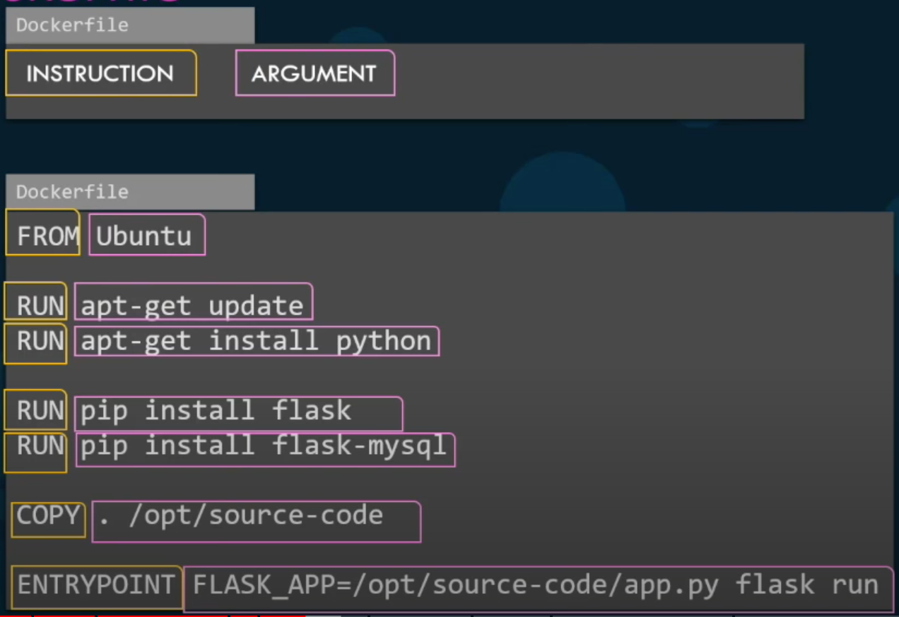
- `FROM Ubuntu` defines what the base OS should be. 
  - Every image must base on an earlier created image that is an OS or an image basing on an OS itself.
  - All dockerfiles MUST start with a FROM instruction
- `RUN <command>` executes the commands, usually to install dependencies
- `COPY <host source> <image dest>` copies files from the host to the image, usually used to copy source code
- `ENTRYPOINT <command>` specifies command to be run when the container is started
  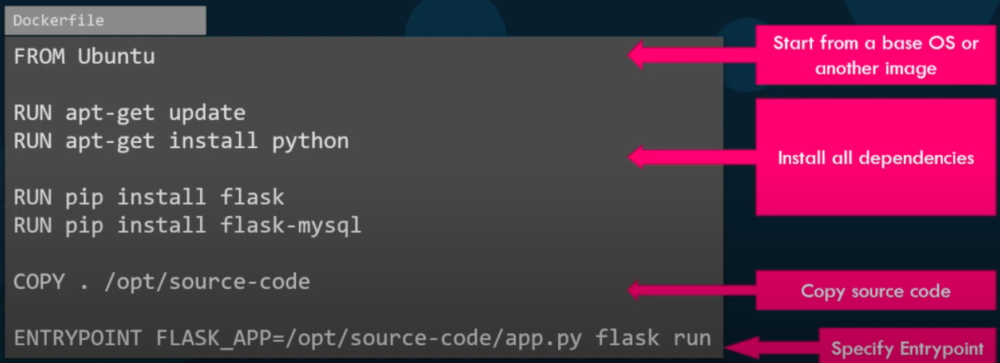

### Layer Architecture
- The docker image is created layer by layer.
- Each instruction in the dockerfile is equivalent to a layer.
- A layer is formed up from the immediately previous layer.
  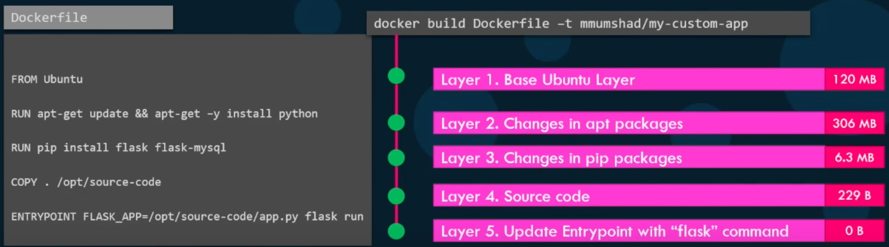
- `docker history <image name>` outputs all past steps performed to create an image
  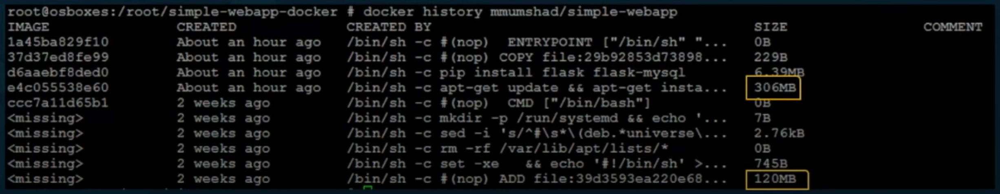

## CMD vs ENTRYPOINT
- If we append a command when issuing `docker run`, that appended command will replace the commands in CMD or ENTRYPOINT
  
### CMD
- `CMD <command>` is an instruction that will tell the container to execute the specified command right after it finishes being initialized.
- The following syntaxes are accepted:
  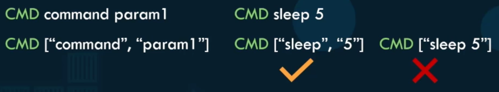

### ENTRYPOINT
- ENTRYPOINT also does the same thing as CMD, but it can accept parameters passed in when we issue `docker run`
  - It is like we just replace the command itself with `docker run <image name>`, so we should expect the same parameter pattern to be accepted
- If we do not specify any parameter(s) that is/are required by the command in ENTRYPOINT, `docker run` will return an error
  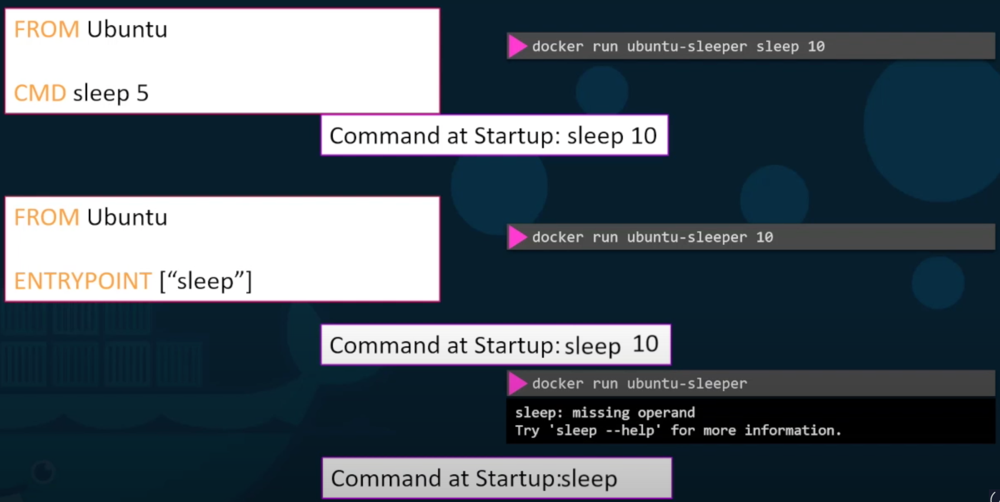
- If we really want to overwrite the default ENTRYPOINT, use the flag `--entrypoint <new command>`
  - For example: `docker run --entrypoint sleep2.0 ubuntu-sleeper 10` to replace the `sleep` default ENTRYPOINT

### Combining CMD and ENTRYPOINT
- Comebine CMD and ENTRYPOINT to use the param(s) specified in CMD when there is none given, otherwise, use the one(s) passed in from the commandline
  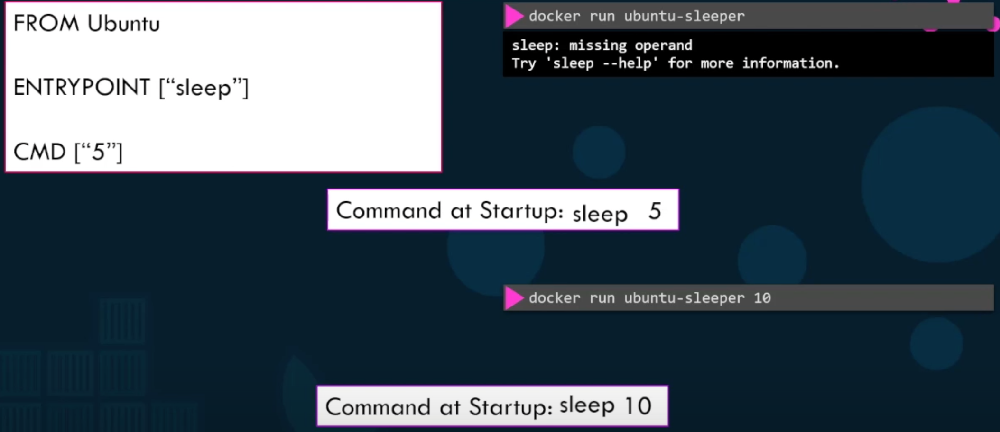

## Networking
- There are 3 default networks: Bridge, None and Host. By default, when a container is started, it will be connected to the Bridge network. If we want to connect to a different network, use the flag `--network=<network name>`
  - For example: `docker run ubuntu --network=none` or `docker run ubuntu --network=host`

### Bridge network
- Bridge is a private network accessible only to docker containers.
- Each docker container in this network is given an internal IP address to communicate with each other.
- To access the container externally, we need to do map a host port to a container port (as above).
  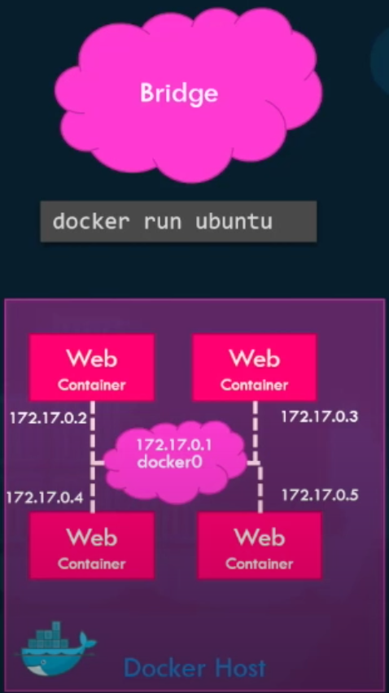

### Host network
- Host is the network of the local host.
- Any container running on the host network no longer needs port mapping as container port will automatically match to the same host port in this network
  - This also means that each port can only be used by one single container
- 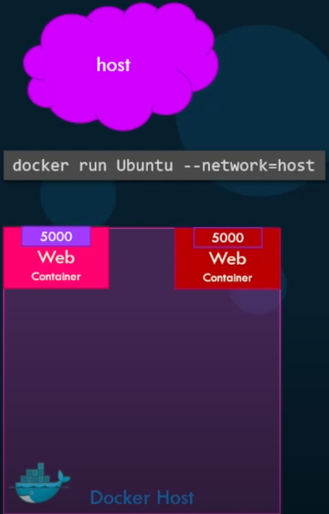

### None network
- The container runs in an isolated network and is not connected to any other containers or the host
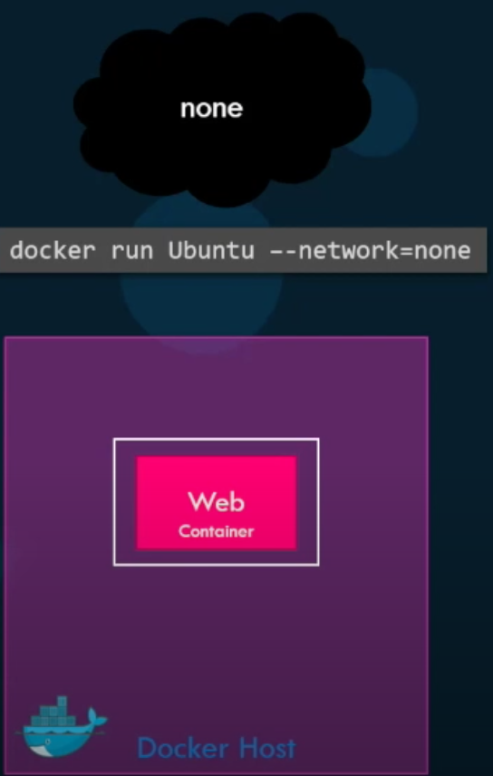

### User-defined network
- Create a custom network for containers using: `docker create --driver bridge --subnet <subnet CIDR notation> <subnet name>`
  - For example: `docker create --driver bridge --subnet 182.18.0.0/16 custom-isolated-network`
- To list all existing networks: `docker network ls`

### Embedded DNS
- Containers can communicate with each other using their names. We should not use the IP address automatically assigned to them because these may change after the host reboots
- The docker DNS server runs at IP address 127.0.0.11 on the host by default
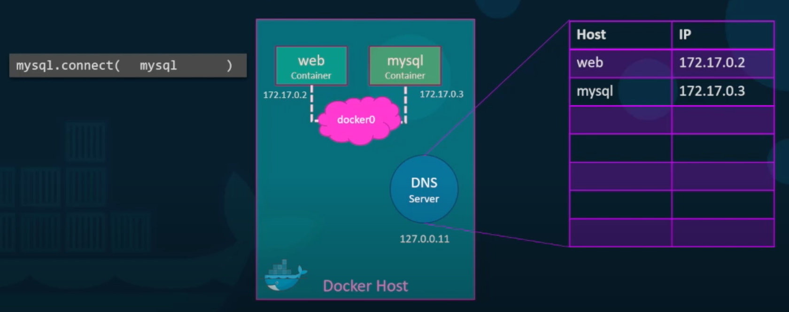

## Docker Storage
### File system
- By default, docker creates the following file structure on the host machine to store data about containers, images, etc.
  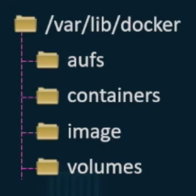

### Layered architecture
- Same as the layered architecture mentioned when we build an image.
- Layers that are already built earlier will be cached so that the next time we update our source code or build an image with mostly similar layers, the build process will be faster.
  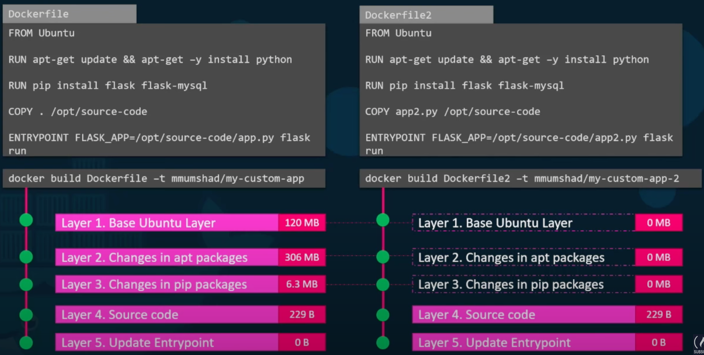
- Image layers are built with the `docker build` command. After having been built, these layers cannot be changed, unless another build command is executed
  - The container formed from the image is the final layer, and this layer only exists as long as the container still exists. This layer is also writable.
  - 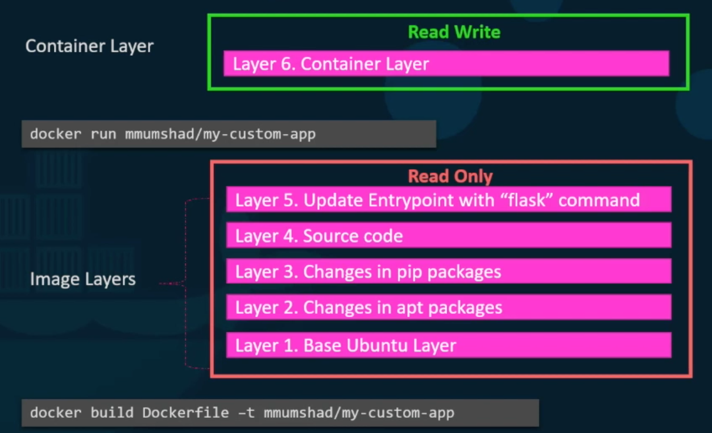
  - Image layers are shared by all containers created using that image
- In the container layer, when we try to modify a file that is read-only in the image layers, a copy of that file will be created and all changes will happen to that copy only (Copy-On-Write).
- When the container terminates, the container layer is also destroyed, thus all data or changes made in that layer will also be gone.
  - To persist data even after the container is terminated, we need to map a volume on the host machine to the container
  - Create a new volume on the host machine using: `docker volumn create <volume name>`
  - Map the volume to the container volume holding data when we issue the run command: `docker run -v <host volume>:<container volume> <image name>`
  - If you do not manually create the volume on host machine first, docker still automatically creates that volume for you. **All existing volumes can be found under `/var/lib/docker/volumes`**
  - If you want to use an existing location as the host volume instead of the default location under `/var/lib/docker/`, you should specify the absolute path to that location when executing `docker run` command
  - Mounting a volume from docker's default location is called **volume mounting**. Mounting a volume from an arbitrary location is called **bind mounting**
  - Using the `-v` flag for volume mounting is old-styled. The new syntax is `docker run --mount type=<volume or bind>,source=<abs path>,target=<abs path> <image name>`
  - 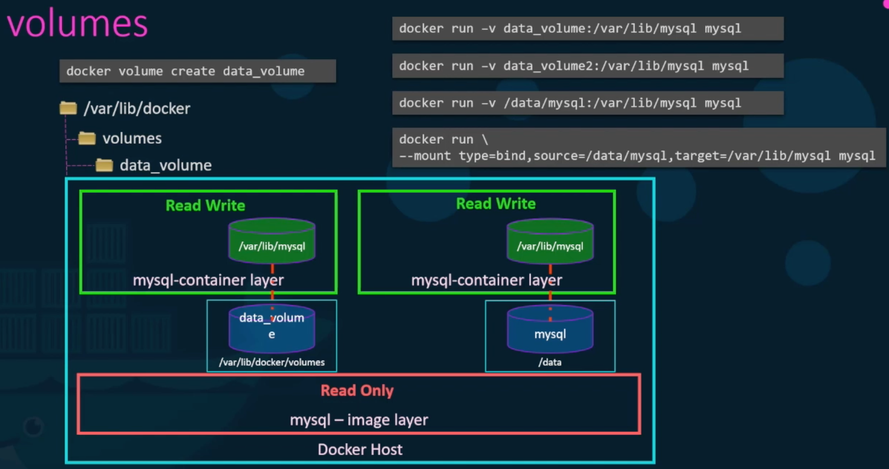

## Docker Compose
- Docker compose is a YML file, typically named `docker-compose.yml`, used to manage the deployment of multiple docker containers
  - Use the command `docker-compose up` to execute the configurations set in the YML file
  - 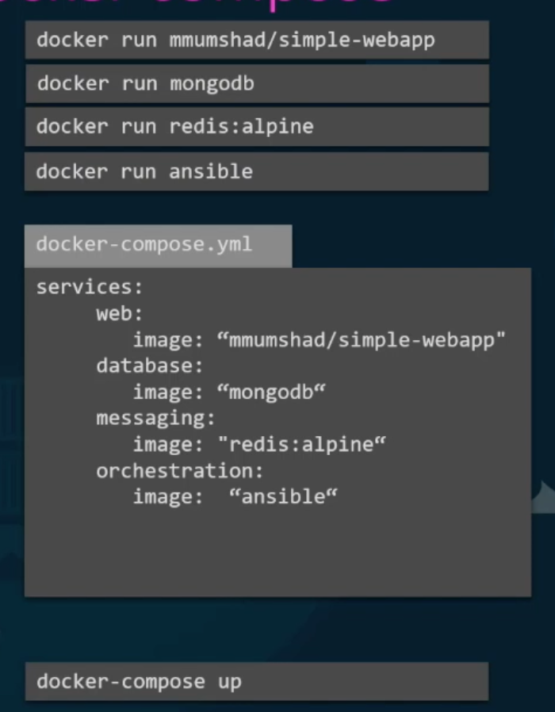

### docker run --links
- For a full-stack application to work, its many component applications need to work together
- Each of these components may run in its own docker container. Thus, these containers need to be linked together, using the flag `--link <container name>:<expected component host>`. 
  - It is vital to always name the container when we execute `docker run` so that we do not have to find the internal IP address of that component container
- 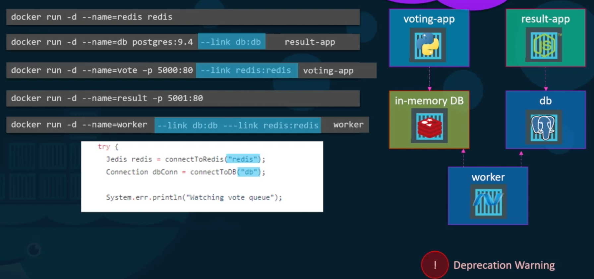

### docker compose (equivalent to using links)
- 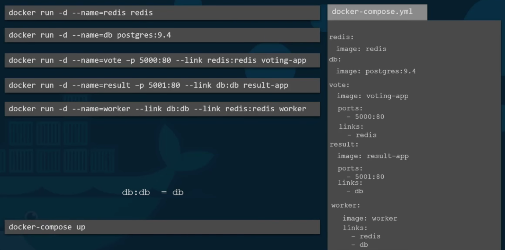
- To start the entire application start, use the `docker-compose up` command
- To tell docker-compose to build images rather than try to pull them from the Docker repository, use `build: <path to dir containing Dockerfile>` instead of `image: <image name>`
  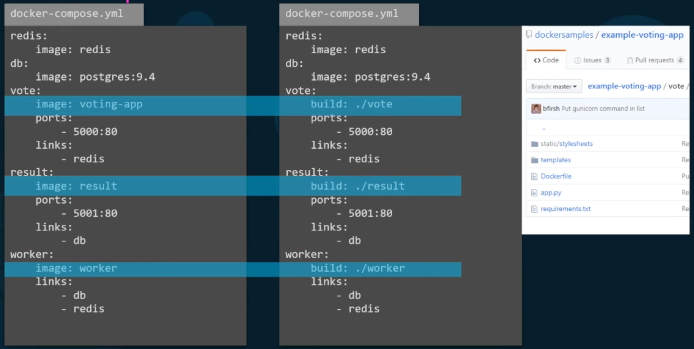

### Different versions
- In docker-compose.yml of version 2+, you must explicitly specify the version of docker-compose YML file you are using 
- Differences across versions:
  - In version 1: 
    - All containers are added into the bridge network and links are established where necessary for inter-communications
  - In version 2:
    - All containers specified in the file are automatically added to a new isolated network for just between them, thus we no longer need to explicitly state the links 
    - You can specify a container start-up order by stating which containers depend on which using the `depends_on` key
  - In version 3:
    - Must contain `version` and `services` keys like version 2 

### Subnets within the network of all containers
- 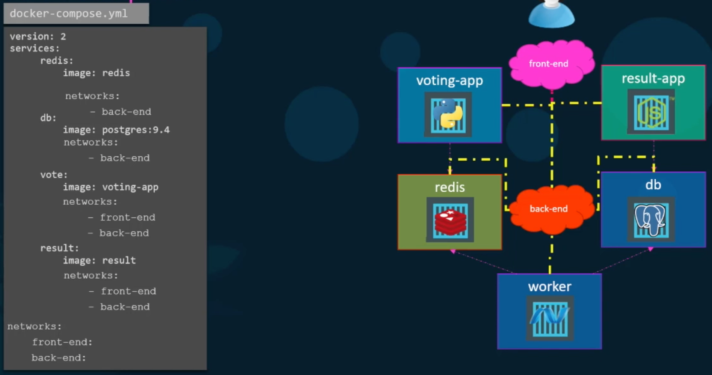
- Create subnets using the key `networks`.
- The subnets that a container has access to should be explicitly specified in the section of that container, also with the keyu `networks`.

## Docker Registry
- The docker registry is the central cloud repository where images can be pushed to and pulled from
- Each image can be identified using the URL in the following form
  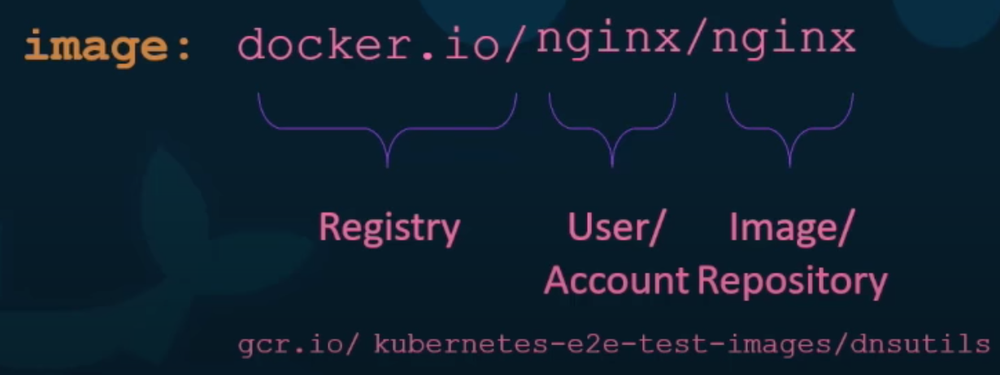

### Private Registry
- 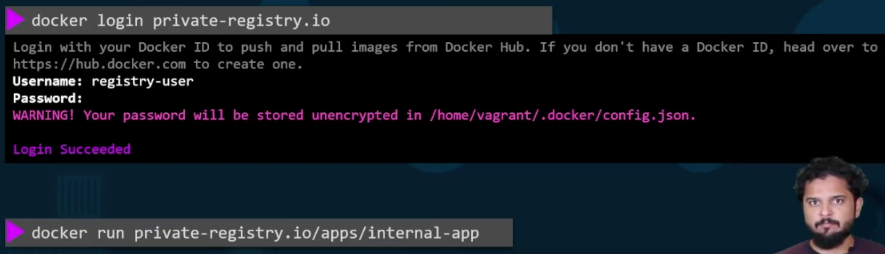
- Private registries require authentication before you can pull or push images to them 

## Miscellaneous Notes
- A container is not a virtual machine. Hence, when a container like "ubuntu" is started, it will end immediately because there is no active process running inside of it.
  - The lifetime of a container is only as long as that of the server/application/computational process that runs inside of it. When the process ends or crashes, the container will automatically terminate as well.
- In any docker commands, you are not required to provide the full id of a container, just a few first letters (5-6) will do.
- Containers have their own isolated file systems. Any data created and modified inside containers will just stay inside containers.
  - If you stop a container and remove it, all data stored inside that container will be gone. 
  - To persist data inside containers, you need to map the volumes storing data to volumes in the file system of the host machine
